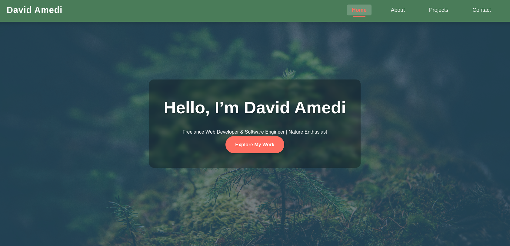

# My Personal Website



Welcome to my personal portfolio website! This project showcases my skills as a freelance web developer and software engineer, highlighting my expertise, projects, and passions for nature and photography. Built with modern web technologies, this site is fully responsive and designed to provide an engaging user experience.

## Features
- Responsive Design - Adapts seamlessly to desktops, tablets, and mobile devices.
- Dynamic Navbar - Highlights the current page with an active state.
- Hero Section - Features a typing animation and random nature-themed background images.
- About Page - Displays a unique hexagon-shaped profile image and skills with SVG icons.
- Projects Page - Includes a filterable project grid, modal details, and a timeline of contributions.
- Contact Page - Offers a form with success feedback, contact info, and social links with a subtle nature background.
- Back-to-Top Button - Smooth scrolling to the top of the page.
- Favicon - Custom icon displayed in browser tabs for branding.

## Technologies Used
- HTML5
- CSS3
- JavaScript - Interactivity (e.g., hamburger menu, typing effect, project modals, navbar highlighting).
- SVG Icons - Skill representations sourced from [Devicon](https://devicon.dev/) and [Iconduck](https://iconduck.com/).
- Assets - Images and icons stored in assets/ for backgrounds, profiles, and social links.

## How to Run
1. Clone the repository.
2. Open `index.html` in your browser.

## File Structure
For easy managing of my pages and styles I had to separate the pages and styles. I used the styles.css for common styles in all pages.
Here is my project structure

```
my-personal-website/
├── assets/
│   ├── icons/              # SVG icons (e.g., python.svg, linkedin.svg, favicon.svg)
│   └── images/             # Images (e.g., profile2.jpg, nature-bg.jpg, project1.jpg)
├── css/
│   ├── styles.css         # Global styles (navbar, footer, buttons)
│   ├── index.css          # Homepage-specific styles
│   ├── about.css          # About page styles
│   ├── projects.css       # Projects page styles
│   ├── contact.css        # Contact page styles
│   └── responsive.css     # Media queries for responsiveness
├── js/
│   └── script.js          # JavaScript for interactivity
├── pages/
│   ├── about.html         # About page
│   ├── projects.html      # Projects page
│   └── contact.html       # Contact page
├── index.html             # Homepage
└── README.md              # This file
```

## Contributing
This is a personal project, but I’m open to feedback! Feel free to:

1. Fork the repository.
2. Create a branch (`git checkout -b feature/improvement`).
3. Commit changes (`git commit -m "Add improvement"`).
4. Push to the branch (`git push origin feature/improvement`).
5. Open a pull request.

In this same repository I will create other branches with new features of the same project.
I will also be updating the project weekly.

## Contact
- **Email**: [amukoahdavid@gmail.com](mailto:amukoahdavid@gmail.com)
- **LinkedIn**: [ameditechwizard](https://www.linkedin.com/in/ameditechwizard/)
- **GitHub**: [AmedDavid](https://github.com/AmedDavid)


## Live Demo
[View Live Demo](https://ameddavid.github.io/my-personal-website/)

